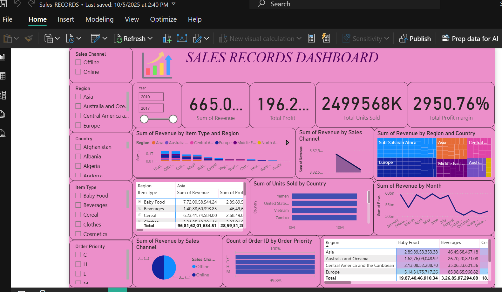

# 📊 Sales Records Dashboard – Power BI

## 📌 Project Overview

This project is an interactive **Sales Records Dashboard built using Microsoft Power BI**.

The dashboard provides insights into sales performance, revenue, profit, orders, regions, countries, sales channels, and product categories.

## 🎯 Project Objectives

- Analyze overall sales performance.
- Track revenue and profit.
- Understand sales by region and country.
- Analyze sales channels.
- Analyze product/item categories.
- Track order activity and trends.
- Provide interactive filtering for business analysis.
- Present key business metrics through an easy-to-use dashboard.

## 📈 Dashboard Features

The dashboard includes:

- Total Sales
- Total Revenue
- Total Profit
- Profit Margin
- Units Sold
- Order Analysis
- Sales by Region
- Sales by Country
- Sales by Item Type
- Sales by Sales Channel
- Order Priority Analysis
- Time-based Sales Analysis
- Interactive filters and slicers

## 🛠️ Tools & Technologies

- Microsoft Power BI
- Power Query
- DAX
- Data Visualization
- Sales Analytics

## 📂 Project Files

Sales-Records-Dashboard/
│
├── Sales-RECORDS.pbix
├── sales-records dashboard.png
└── README.md

## 📸 Dashboard Preview

